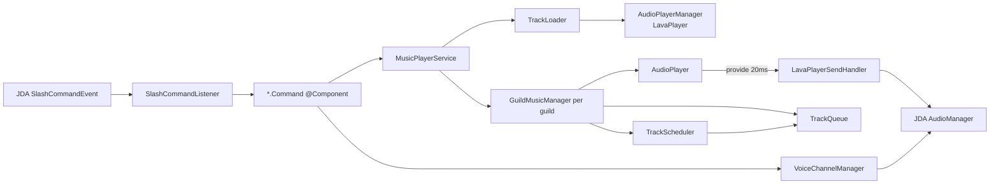
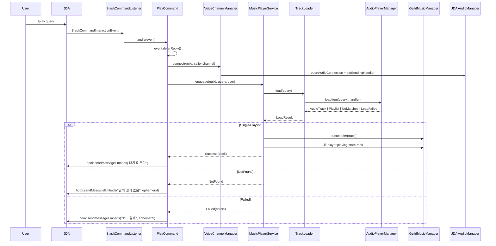

# 노래봇(Music Bot) 모듈 아키텍처 설계

> 문서 버전: 0.1 / 작성일: 2026-04-22
> 대상 저장 경로: `docs/music-bot-architecture.md`

## 1. 개요 및 목표

### 제공 기능 (MVP 이상)
- 재생 제어: `/play`(URL·검색어), `/pause`, `/resume`, `/skip`, `/stop`
- 큐 관리: `/queue`, `/nowplaying`, `/remove`, `/shuffle`
- 재생 모드: `/loop`(off / track / queue), `/volume`
- 보이스 채널: `/join`, `/leave` + 혼자 남았을 때 자동 퇴장

### 아키텍처 일관성 원칙
- 새 모듈은 `coin` 모듈 구조(`commands/` · `service/` · `data/` · `util/`)를 그대로 차용. `player/`, `queue/` 하위는 음악 도메인 특성상 추가.
- 모든 슬래시 커맨드는 `com.DiscordBot.KotlinDiscordBot.command.SlashCommand`를 구현한 Spring `@Component`로 작성 → `JdaConfig`가 `List<SlashCommand>`로 자동 주입·등록.
- Discord 노출 문자열과 주석은 한국어. 명령어 이름 로컬라이제이션은 `setNameLocalization(DiscordLocale.KOREAN, ...)` 패턴 사용.
- 비동기: JDA 이벤트 스레드에서 블로킹 금지. 긴 작업은 `deferReply()` → `hook.sendMessage...`.

### 무료 운영 원칙 (Zero-Cost Playback)
- **유료 서비스·API 키 전면 배제**: 기본 범위에서 결제·월 구독이 필요한 외부 서비스(Spotify Premium SDK, Apple Music, Deezer 유료, YouTube Data API 할당 초과분 등)를 사용하지 않는다.
- **추가 인프라 비용 0원**: 오디오 엔진은 봇 JVM 내장형(LavaPlayer)만 사용. Lavalink 노드·별도 VM·CDN·캐시 스토리지를 도입하지 않는다. 배포 호스트는 지금의 단일 서버(`deploy.yml` scp 대상) 그대로.
- **계정 가입·OAuth 최소화**: 기본 재생 경로(YouTube / SoundCloud / Bandcamp / HTTP 직접 URL)는 사용자·운영자 모두 가입/토큰 발급 없이 동작해야 한다. 토큰이 필요한 소스는 **선택(Optional)** 으로만 노출하고 부재 시 기능만 숨긴다.
- **디스크 사용 최소**: 트랙을 로컬에 캐시·다운로드하지 않는다(스트리밍만). 저작권·스토리지 비용 동시 회피.

## 2. 기술 선택 및 의존성

### 오디오 엔진 비교 (비용 관점 포함)

| 항목 | LavaPlayer (임베디드) | Lavalink (외부 서버) |
|------|----------------------|----------------------|
| **운영 비용** | **$0 — 봇 JVM에 내장** | 별도 노드 VM/컨테이너 비용 발생 |
| 배포 복잡도 | JAR 하나, 별도 프로세스 불필요 | Node(Lavalink) 별도 실행·관리 |
| 리소스 분리 | 봇 JVM과 공유 | 별도 JVM, 봇 재시작 내구성 높음 |
| 여러 봇 샤딩 | 불리 | 유리 |
| 현 배포 환경 | 단일 호스트(`deploy.yml`의 scp + systemd) | 추가 서비스 유닛 + 호스팅 필요 |
| 라이브러리 라이선스 | Apache-2.0 (무료) | Apache-2.0 (무료) |

**추천: LavaPlayer (dev.arbjerg 포크)** — **무료 운영 원칙과 직접 부합**. 라이브러리 자체가 오픈소스이고, 기존 Spring Boot 프로세스 안에 그대로 포함돼 추가 인프라 비용이 발생하지 않는다. Lavalink는 소프트웨어 자체는 무료지만 실행 노드가 별도 호스팅 비용을 유발하므로 본 프로젝트에선 제외. 필요 시 `MusicPlayerService` 구현체만 교체하도록 추상화한다.

### 소스 지원 범위 — 무료 우선

**기본(무가입·무토큰, MVP에 포함)**
- **YouTube** — `dev.lavalink.youtube:v2` 플러그인. API 키 불필요(내부적으로 공개 웹 엔드포인트 사용). Google Cloud의 YouTube Data API(할당량 초과 시 결제)는 **사용하지 않는다**.
- **SoundCloud** — LavaPlayer 기본 소스. 토큰 불필요.
- **Bandcamp** — LavaPlayer 기본 소스. 토큰 불필요.
- **Twitch / Vimeo** — LavaPlayer 기본 소스. 공개 스트림에 한해 토큰 불필요.
- **HTTP 직접 URL / Discord 첨부 파일** — 공개 MP3/OGG/FLAC 스트림, CC0 샘플 등. 완전 무료.
- **인터넷 라디오 스트림** — ICY/Shoutcast URL 직접 입력. 무료 라디오 방송 활용 가능.

**제외 / 비권장**
- ~~Spotify~~ — 트랙 자체 재생은 Premium SDK(유료) 필요. lavasrc 메타데이터 브리징은 "Spotify 개발자 계정 등록"이 필요하므로 **무료 운영 원칙(계정 가입 최소화)과 배치** → 기본 스코프에서 제외. 사용자가 곡명을 직접 치면 YouTube 검색으로 동일한 UX 달성 가능.
- ~~Apple Music / Deezer 유료~~ — 유료 구독 또는 유료 API 필요. 제외.
- ~~YouTube Data API v3~~ — 검색/메타데이터용 공식 API는 하루 할당량 초과 시 사실상 유료 → 사용 금지. YouTube 플러그인의 `ytsearch:` 접두사가 무료 대안.

### `build.gradle.kts` 추가 라인 (무료 구성)
```kotlin
// LavaPlayer 본체 (arbjerg 포크, JDA5 호환, Apache-2.0)
implementation("dev.arbjerg:lavaplayer:2.2.2")
// YouTube 소스 플러그인 (순정 YouTube 소스 대체, 필수, 무료)
implementation("dev.lavalink.youtube:v2:1.11.4")
// JDA 5는 com.sedmelluq:lava-common, club.minnced:opus-java를 이미 전이 의존 → 중복 선언 금지
// lavasrc(Spotify 브리징)는 무료 운영 원칙상 의도적으로 추가하지 않음
```
이유: 두 라이브러리 모두 오픈소스 무료이고 외부 결제·계정 없이 동작. YouTube v2 플러그인은 PoToken/VisitorData 갱신에 대응하지만 이 값들도 모두 사용자의 브라우저에서 한 번 추출하면 끝 — **유료 API 호출 없음**.

### Opus · `AudioSendHandler` 연동
- JDA는 `net.dv8tion.jda.api.audio.AudioSendHandler` 인터페이스만 제공. 실제 오디오 바이트를 공급하는 주체는 우리 쪽.
- LavaPlayer의 `AudioPlayer.provide(ByteBuffer)`를 `AudioSendHandler.provide20MsAudio()` 안에서 호출하는 **어댑터 클래스**(`LavaPlayerSendHandler`)를 만든다. `canProvide()` → `player.provide(buffer)` → `isOpus() = true` 패턴.
- `AudioManager#setSendingHandler(handler)`로 길드별 등록.

## 3. 패키지 및 파일 구조

```
com.DiscordBot.KotlinDiscordBot.music
├── commands/              슬래시 커맨드 (SlashCommand 구현체)
├── service/               애플리케이션 서비스 계층
├── player/                LavaPlayer 래퍼 + JDA 어댑터
├── queue/                 트랙 큐·반복·셔플 로직
├── data/                  DTO / 엔티티 (Phase 3)
└── util/                  상수·시간 포맷·URL 판별
```

| 경로 | 주요 클래스 | 책임 |
|------|-------------|------|
| `commands/` | `PlayCommand`, `PauseCommand`, `ResumeCommand`, `SkipCommand`, `StopCommand`, `QueueCommand`, `NowPlayingCommand`, `VolumeCommand`, `LoopCommand`, `ShuffleCommand`, `RemoveCommand`, `JoinCommand`, `LeaveCommand` | 이벤트 파싱, `MusicPlayerService` 위임, 임베드 응답 |
| `service/` | `MusicPlayerService`, `VoiceChannelManager`, `TrackLoader` | 도메인 로직의 진입점. 커맨드는 이곳만 호출 |
| `player/` | `GuildMusicManager`, `LavaPlayerSendHandler`, `TrackScheduler` | 길드별 `AudioPlayer` 보유, JDA 송출 어댑터, 이벤트 리스너 |
| `queue/` | `TrackQueue`, `LoopMode`, `QueueSnapshot` | FIFO + 반복/셔플, 읽기용 스냅샷 |
| `data/` | `PlayRequest`, `TrackInfoDto`, (Phase 3) `PlaylistEntity`, `PlaylistTrackEntity` | 전송 객체 및 엔티티 |
| `util/` | `DurationFormatter`, `UrlDetector`, `MusicConstants` | `hh:mm:ss` 포맷, URL/검색어 판별 |

> `coin` 모듈도 `commands/`·`service/`·`data/`·`util/` 구조이며 데이터 저장용 엔티티는 `money` 모듈로 분리되어 있음. 음악은 초기엔 엔티티 없이 in-memory 로 시작하므로 `data/`를 비워두거나 DTO만 둔다.

## 4. 핵심 컴포넌트 설계

### 컴포넌트 관계도



### 각 컴포넌트 책임

**`GuildMusicManager`** — 길드별 상태 컨테이너
```kotlin
class GuildMusicManager(
    val guildId: Long,
    val player: AudioPlayer,
    val scheduler: TrackScheduler,
    val sendHandler: AudioSendHandler,
) { fun shutdown() }
```
- `MusicPlayerService` 내부의 `ConcurrentHashMap<Long, GuildMusicManager>`로 보관. `computeIfAbsent`로 원자적 생성.
- `player`·`scheduler`·`queue`에 대한 모든 접근은 이 인스턴스의 메서드를 경유해 길드 단위 일관성 유지.

**`MusicPlayerService`** — LavaPlayer `AudioPlayerManager` 래핑
```kotlin
@Service
class MusicPlayerService(private val loader: TrackLoader) {
    private val apm: AudioPlayerManager = DefaultAudioPlayerManager().also {
        YoutubeAudioSourceManager().let(it::registerSourceManager)
        AudioSourceManagers.registerRemoteSources(it)
    }
    private val managers = ConcurrentHashMap<Long, GuildMusicManager>()
    fun get(guild: Guild): GuildMusicManager
    fun enqueue(guild: Guild, query: String, requester: User): Mono<LoadResult>
    fun skip(guild: Guild): Track?
    fun setLoop(guild: Guild, mode: LoopMode)
    // ...
}
```

**`TrackQueue`** — FIFO + 모드
```kotlin
class TrackQueue {
    private val deque = ConcurrentLinkedDeque<AudioTrack>()
    @Volatile var loopMode: LoopMode = LoopMode.OFF
    fun offer(t: AudioTrack); fun poll(): AudioTrack?
    fun remove(index: Int): AudioTrack?
    fun shuffle()  // synchronized 블록으로 list 스냅샷 후 교체
    fun snapshot(): List<AudioTrack>
}
enum class LoopMode { OFF, TRACK, QUEUE }
```

**`TrackScheduler`** — `AudioEventAdapter` 구현
```kotlin
class TrackScheduler(
    private val player: AudioPlayer,
    private val queue: TrackQueue,
    private val onNothingLeft: () -> Unit,
) : AudioEventAdapter() {
    override fun onTrackEnd(player, track, reason) {
        if (!reason.mayStartNext) return
        val next = when (queue.loopMode) {
            LoopMode.TRACK -> track.makeClone()
            LoopMode.QUEUE -> { queue.offer(track.makeClone()); queue.poll() }
            LoopMode.OFF   -> queue.poll()
        }
        if (next != null) player.startTrack(next, false) else onNothingLeft()
    }
}
```

**`VoiceChannelManager`**
- `connect(guild, channel)`: 호출자의 음성 채널 검증 → `guild.audioManager.openAudioConnection(channel)` + `sendingHandler` 세팅.
- `disconnect(guild)`: 큐 정리 + `closeAudioConnection()`.
- 자동 퇴장: `GuildVoiceUpdateListener`에서 해당 보이스 채널 인원(봇 제외) 0이면 `ScheduledExecutorService`에 N초 후 disconnect 예약. 사람이 다시 들어오면 취소.

**`TrackLoader`**
```kotlin
@Component
class TrackLoader(private val apm: AudioPlayerManager) {
    fun load(query: String): Mono<LoadResult>   // URL이면 그대로, 아니면 "ytsearch:" 프리픽스
}
sealed interface LoadResult {
    data class Single(val track: AudioTrack): LoadResult
    data class Playlist(val tracks: List<AudioTrack>, val name: String): LoadResult
    data class Search(val top5: List<AudioTrack>): LoadResult  // 사용자가 선택
    data object NotFound: LoadResult
    data class Failed(val cause: Throwable): LoadResult
}
```
- 검색 UX: 상위 5개를 `StringSelectMenu`로 ephemeral 응답 → 사용자가 고르면 `enqueue`. (초기에는 "ytsearch:" + 첫 결과 자동 선택으로 단순화 가능)
- `AudioPlayerManager.loadItem`은 콜백 기반 → `Mono.create`로 감싸 coin 모듈처럼 Reactor 체인 사용.

## 5. 슬래시 커맨드 목록

| 이름 (ko) | 설명 | 옵션 | 구현 클래스 | 호출 서비스 |
|---|---|---|---|---|
| `/play` (재생) | URL 또는 검색어로 재생·큐 추가 | `query: STRING` 필수 | `PlayCommand` | `VoiceChannelManager.connect` + `MusicPlayerService.enqueue` |
| `/pause` (일시정지) | 현재 트랙 정지 | 없음 | `PauseCommand` | `MusicPlayerService.setPaused(true)` |
| `/resume` (재개) | 일시정지 해제 | 없음 | `ResumeCommand` | `MusicPlayerService.setPaused(false)` |
| `/skip` (스킵) | N곡 스킵 | `count: INTEGER` 선택(기본 1) | `SkipCommand` | `MusicPlayerService.skip` |
| `/stop` (정지) | 큐 비우고 정지 | 없음 | `StopCommand` | `MusicPlayerService.stopAndClear` |
| `/queue` (대기열) | 대기열 목록 | `page: INTEGER` 선택 | `QueueCommand` | `MusicPlayerService.snapshot` |
| `/nowplaying` (지금곡) | 현재 재생 정보 | 없음 | `NowPlayingCommand` | `MusicPlayerService.current` |
| `/volume` (볼륨) | 0~150 | `level: INTEGER` 필수 | `VolumeCommand` | `MusicPlayerService.setVolume` |
| `/loop` (반복) | off / track / queue | `mode: STRING choices` 필수 | `LoopCommand` | `MusicPlayerService.setLoop` |
| `/shuffle` (셔플) | 대기열 셔플 | 없음 | `ShuffleCommand` | `MusicPlayerService.shuffle` |
| `/remove` (대기열제거) | 인덱스 제거 | `index: INTEGER` 필수 | `RemoveCommand` | `MusicPlayerService.remove` |
| `/join` (입장) | 봇을 음성채널에 | 없음 | `JoinCommand` | `VoiceChannelManager.connect` |
| `/leave` (퇴장) | 봇 퇴장 | 없음 | `LeaveCommand` | `VoiceChannelManager.disconnect` |

공통 패턴(coin 모듈과 동일):
- `event.deferReply().queue()` 후 비동기 결과는 `event.hook.sendMessageEmbeds(...)`
- 오류 시 빨간색 `EmbedBuilder` + `setEphemeral(true)`

## 6. 이벤트 흐름

### `/play` 시퀀스 다이어그램



### 트랙 종료 → 다음 트랙
- `TrackScheduler.onTrackEnd(reason.mayStartNext == true)` 시 `LoopMode`에 따라 다음 트랙 선택 후 `player.startTrack`.
- 큐가 비면 `onNothingLeft` 콜백 → `VoiceChannelManager`에 유휴 타이머 예약.

### 예외 처리
- 트랙 로드 실패: `AudioLoadResultHandler.loadFailed(FriendlyException)` → ephemeral 에러 임베드.
- 호출자 음성 채널 미접속: `PlayCommand` 선검증, "먼저 음성 채널에 들어와주세요" 안내(coin의 `existsMember` 가드와 동일한 패턴).
- JDA가 채널에서 강제 disconnect(권한 변경 등): `GuildVoiceUpdateEvent`에서 감지, 큐 정리 + 상태 리셋.

## 7. 영속성 결정

### MVP: DB 비사용
- 재생 상태(큐·볼륨·모드)는 휘발성으로 충분. 봇 재시작 시 큐 유지는 UX 요구가 낮고 구현 비용은 큼.
- 기존 `coin`의 `Wallet`/`Position`과 달리 음악은 금전적 불변식이 없음.

### Phase 3 (선택): 즐겨찾기 플레이리스트
JPA 엔티티 초안:
```kotlin
@Entity @Table(name = "music_playlist")
class PlaylistEntity(
    @Id @GeneratedValue var id: Long? = null,
    @ManyToOne val member: MemberEntity,   // member 모듈 기존 엔티티 참조
    val name: String,
    @OneToMany(mappedBy = "playlist", cascade = [ALL], orphanRemoval = true)
    val tracks: MutableList<PlaylistTrackEntity> = mutableListOf(),
    val createdAt: Instant = Instant.now(),
)

@Entity @Table(name = "music_playlist_track")
class PlaylistTrackEntity(
    @Id @GeneratedValue var id: Long? = null,
    @ManyToOne val playlist: PlaylistEntity,
    val url: String,         // 재생은 URL 재로드로 복원
    val title: String,
    val durationMs: Long,
    val position: Int,
)
```
- `music/data/` 아래 배치. `MemberEntity`와의 FK는 `member/domain/` 기존 엔티티 참조(coin → money → member 경유 패턴 따름).

## 8. 설정 및 환경 변수

`application.yaml.example`에 추가할 블록 — **모든 외부 토큰은 선택(Optional)**. 비워두면 해당 기능만 비활성화되고 기본 재생(YouTube/SoundCloud/HTTP)은 정상 동작한다.
```yaml
music:
  default-volume: ${MUSIC_DEFAULT_VOLUME:60}       # 0~150
  max-queue-size: ${MUSIC_MAX_QUEUE_SIZE:200}
  max-track-length-sec: ${MUSIC_MAX_TRACK_SEC:10800}  # 3h
  idle-disconnect-sec: ${MUSIC_IDLE_DISCONNECT_SEC:180}
  alone-disconnect-sec: ${MUSIC_ALONE_DISCONNECT_SEC:60}
  search-result-size: ${MUSIC_SEARCH_SIZE:5}
  youtube:
    # 모두 선택. 비워도 기본 재생 정상 동작. 봇 차단이 잦을 때만 사용자 브라우저에서 추출해 주입.
    po-token: ${YT_PO_TOKEN:}
    visitor-data: ${YT_VISITOR_DATA:}
  # Spotify/Apple Music 등 계정·결제가 필요한 소스는 의도적으로 미포함 (무료 운영 원칙)
```
`@ConfigurationProperties("music")` + `MusicProperties` 데이터 클래스로 바인딩. `pubp`의 `PUBG_API_KEY`가 `.env`를 통해 배포 서버에 주입되는 관행을 그대로 따르되, 음악 모듈은 **키 없이도 구동되도록** 모든 `*-token` 속성을 `Optional<String>`으로 취급한다.

## 9. 동시성·스레드·코루틴 전략

- **길드별 격리**: `MusicPlayerService.managers: ConcurrentHashMap<Long, GuildMusicManager>`. `computeIfAbsent` 사용.
- **JDA 이벤트 스레드 보호**: 슬래시 커맨드 핸들러에서 `deferReply()` 즉시 호출, `AudioPlayerManager.loadItem`은 자체 스레드에서 콜백 → 응답은 `event.hook`으로.
- **LavaPlayer 스레드풀**: 재생 루프/로딩은 LavaPlayer 내부 스레드. 우리 코드는 콜백에서 짧게만 처리.
- **큐 동시성**: `ConcurrentLinkedDeque` + 셔플처럼 복합 연산만 `synchronized(this)` 블록.
- **코루틴**: 기존 코인은 Reactor Mono 기반이지만 음악은 이벤트 리스너가 많으므로, 복잡한 로드 체인(검색 5개 → 선택 → 큐 추가 대기)은 `kotlinx-coroutines` `suspendCancellableCoroutine`로 LavaPlayer 콜백을 브리지해서 서비스 레이어를 `suspend fun`으로 깔끔하게 유지해도 된다(기존 `kotlinx-coroutines-core:1.8.0` 이미 포함).
- **볼륨 등 원자 필드**: `@Volatile` int / `AtomicReference<LoopMode>`.

## 10. 테스트 전략

### 단위 테스트 (기본 `test` 태스크 — live 태그 제외됨)
- `TrackQueueTest`: offer/poll/remove/shuffle/LoopMode 전이 검증
- `DurationFormatterTest`: 초 → `hh:mm:ss` 포맷
- `UrlDetectorTest`: URL vs 검색어 판별
- `TrackSchedulerTest`: `onTrackEnd`에서 다음 트랙 선택 분기(3가지 LoopMode + `mayStartNext=false`) — LavaPlayer의 `AudioTrack`은 모킹

### 통합 테스트 (`@Tag("live")` — `./gradlew liveTest`로만 실행)
- 실제 Discord 토큰으로 테스트 길드에 join → 짧은 CC0 샘플 URL 재생 → 3초 후 skip → leave. `MusicPlayerService` 빈을 Spring 컨텍스트로 띄워 검증.
- YouTube 로드 경로는 네트워크 의존이 크므로 live 태그에만 유지.

## 11. 배포 및 운영

- **추가 운영비용: 0원** — 새 호스트·외부 서비스·유료 API를 도입하지 않는다. 기존 Tailscale+SSH 배포 서버 하나로 전부 커버.
- **Opus 네이티브**: JDA 5에 포함된 `opus-java`가 플랫폼별 네이티브 라이브러리(`libopus`)를 내장. 배포 호스트가 `linux-x86_64`면 추가 작업 불필요. ARM/musl 환경이면 `opus-java-natives` 분류자 명시 필요.
- **`deploy.yml` 영향**:
  - 빌드 단계(`./gradlew clean bootJar -x test`) 변경 없음. 의존성만 추가되므로 JAR 크기 ~10MB 증가.
  - 배포 서버에 `ffmpeg`는 필요 없음(LavaPlayer가 자체 디코딩).
  - `.env` 주입 블록에 `MUSIC_*` 라인만 추가(모두 기본값 있음, 토큰은 선택). `YT_PO_TOKEN`은 봇 차단이 잦을 때만 설정, Spotify 키는 **추가하지 않음**.
  - systemd 유닛 메모리 한도 점검: LavaPlayer 버퍼 + 대형 길드 동시 재생 시 +256~512MB 여유 권장.
- **네트워크 비용**: YouTube/SoundCloud 스트리밍은 재생 중인 길드 수에 비례한 아웃바운드 트래픽을 유발한다(트랙 → 봇 → Discord 릴레이). 배포 서버가 종량제 대역폭이라면 동시 재생 수를 `music.max-queue-size`와 별도로 길드당 1세션으로 제한하는 것으로 관리. 무제한 트래픽 VPS라면 비용 0.
- **로그**: `com.sedmelluq`/`dev.arbjerg` 패키지 `WARN` 수준으로 억제해 기동 로그 잡음 감소.
- **JDA Intents**: `application.yaml`의 `jda.intents`에 `GUILD_VOICE_STATES` 필수 — 음성 채널 상태 수신. `JdaConfig`는 현재 intents 바인딩이 없으므로 `JDABuilder.enableIntents(...)` 추가가 필요.
- **법적 고려(무료와 별개)**: YouTube/Spotify 등의 ToS는 봇 스트리밍을 명시적으로 허용하지 않는 경우가 있음. 본 설계는 "**비용이 발생하지 않는다**"를 보장할 뿐 ToS 준수를 보장하지 않는다. 공개 서버 배포 전에는 사용자에게 "개인/소규모 사용" 안내 문구를 고지할 것을 권장.

## 12. 구현 로드맵

### Phase 1 — MVP 재생 (2~3일)
범위: `/play`(URL만), `/pause`, `/resume`, `/skip`, `/stop`, `/nowplaying`, `/leave` + `GuildMusicManager`, `TrackScheduler`, `LavaPlayerSendHandler`, 자동 idle 퇴장
검증: YouTube 단일 URL → 재생/일시정지/스킵 수동 QA, `TrackQueueTest` 통과

### Phase 2 — 큐·검색·반복 (2~3일)
범위: `/queue`, `/remove`, `/shuffle`, `/loop`, `/volume`, `/play` 검색어 지원(`ytsearch:` 상위 1 자동 선택 → 이후 StringSelectMenu)
검증: 3곡 연속 재생·셔플·loop=queue 1 사이클 정상, live 통합 테스트 추가

### Phase 3 — 품질·운영 (선택, 무료 범위 유지)
범위: 플레이리스트 JPA(엔티티/커맨드 `/pl save`, `/pl load` — 기존 PostgreSQL 재사용, 비용 0), 메트릭(재생 시간/길드별 in-memory Micrometer), 오디오 필터(bass boost/nightcore 등 LavaPlayer 내장 `AudioFilter`)
검증: `PlaylistEntity` CRUD 통합 테스트, `/pl load` 후 큐 복원 동작
**의도적으로 스코프 밖**: Spotify/Apple Music 연동, Lavalink 전환 — 모두 추가 계정·인프라 비용 유발이므로 "무료 운영 원칙"과 충돌. 향후 재평가 시점에 별도 문서로 트레이드오프 기록.
